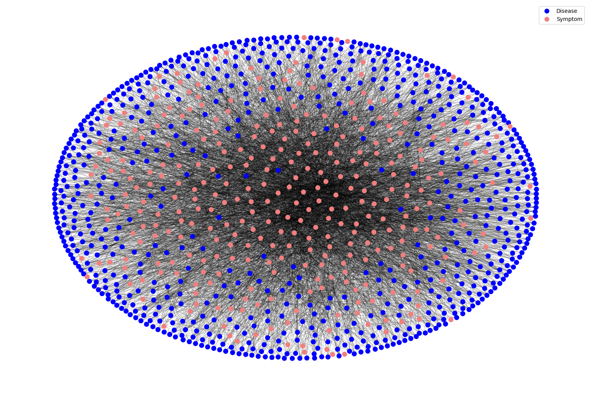
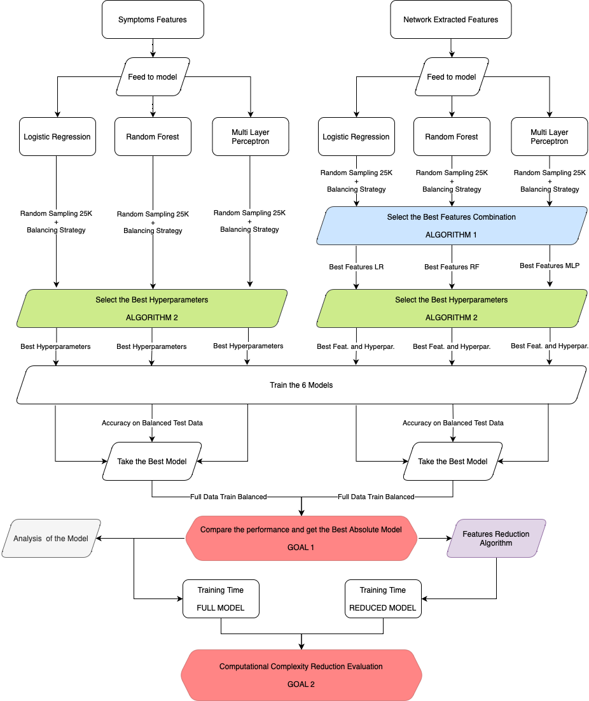
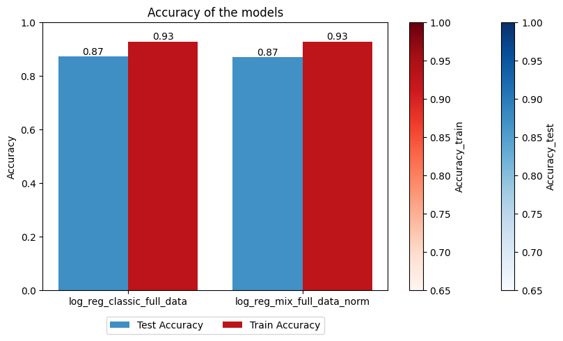
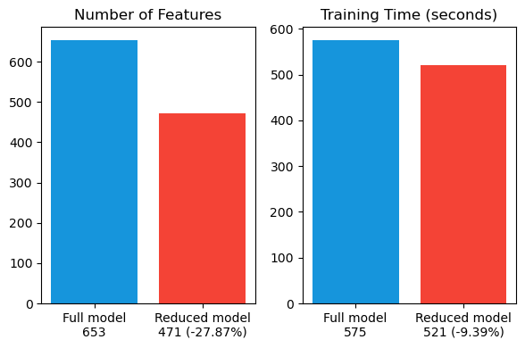

# Disease Prediction Project

Welcome to the Disease Prediction Project repository! This project addresses the intricate relationships between symptoms and diseases in healthcare, combining network analysis with machine learning for accurate diagnosis, predictive analytics and model complexity reduction.

## Dependencies

- `Python 3.x`
- `NetworkX`
- `Pandas`
- `Numpy`
- `Scikit-learn`
- `Matplotlib`
- `Seaborn`
- `powerlaw`

## Overview

In the dynamic field of healthcare, understanding the complex interactions between symptoms and diseases is crucial. This project integrates theoretical frameworks with empirical data to unravel these complexities. Key objectives include:

1. **Network Analysis:** Explore complex network configurations using bipartite models and non-weighted edges.
2. **Predictive Modeling:** Utilize machine learning models—Logistic Regression, Random Forest, and Multi-Layer Perceptron—to surpass existing benchmarks.
3. **Feature Extraction:** Leverage network characteristics to extract novel features for enhanced predictive capabilities.
4. **Complexity Reduction:** Utilize network information to reduce symptoms, optimizing efficiency while preserving accuracy.

## Network Type

Given the symptoms and diseases data we opted for a bipartite graph representing them. 

## Operational Flow for the Model

The operational flow involves feature extraction, model training, and complexity reduction. Models are trained using a combination of symptoms and other features, and complexity reduction is applied to retain relevant features. 

## Results

- **Goal 1:** New features offer comparable performance to symptoms alone. 
- **Goal 2:** Feature reduction achieves a trade-off between accuracy and data reduction, with a 9.39% reduction in training time. 

## Conclusion

This study successfully integrates network analysis with machine learning, achieving an effective balance between feature reduction and model performance. Logistic Regression emerges as the most effective model.

## Limits and Future Works

### Limits

1. Feature selection may be suboptimal due to the sequential approach.
2. Hyperparameter tuning relies on accuracy as the sole metric.
3. Feature reduction process may yield suboptimal results.

### Future Work

1. Explore leveraging features extracted from symptom communities explicitly.
2. Treat diseases as a multi-label classification problem.
3. Nuanced exploration of disease complexity, adjusting thresholds to maximize accuracy.
4. Investigate the prediction of rare diseases.

Feel free to explore the detailed documentation and analysis in the repository, and thank you for visiting! Your feedback and contributions are highly appreciated.

## License

This project is licensed under the [Your License Name] - see the [LICENSE.md](LICENSE.md) file for details.
